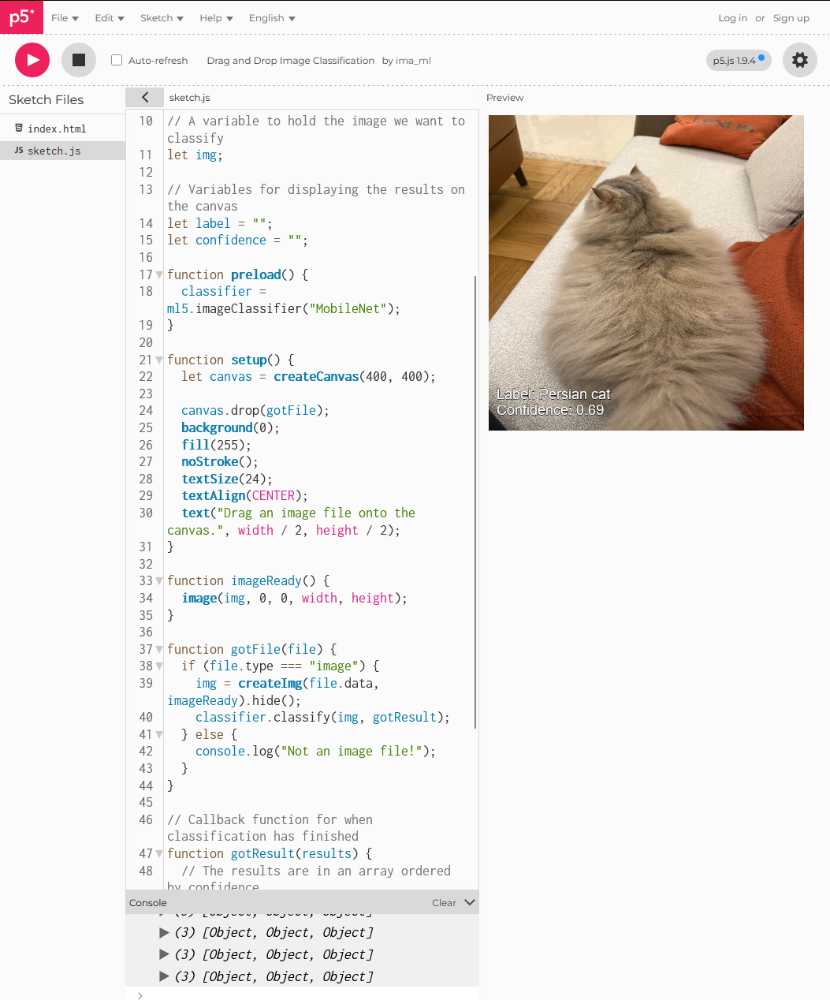
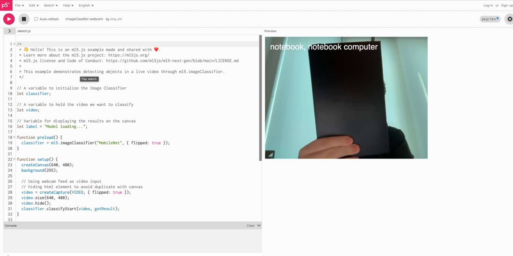
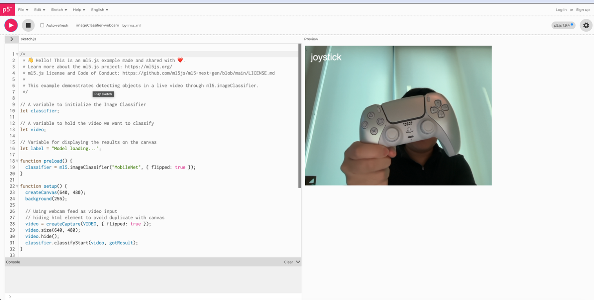

# Assignment 1

## First four things that come to mind

**When you hear the words "Artificial Intelligence", what are the first four things that come to your mind?**

1. Robots
2. Chatbots
3. Voice assistants
4. fiction

### Top three devices and services I use daily

1. My smartphone, from the morning alarm to the last scroll at night
2. Instagram and my group chats
3. Google Maps and search

### A time AI surprised me

One morning my phone showed me a slideshow of an old trip, set to music, that I never asked for. It felt sweet and a little uneasy. It had sorted months of photos and guessed which memory would move me.

### What function AI plays

| Device or service | AI function |
| --- | --- |
| Email inbox | Filters spam, sorts mail into tabs, flags what looks urgent, and suggests short replies. |
| Check depositing | Reads the amount and account numbers from a photo of the check, even handwriting. |
| Texting and mobile keyboards | Autocorrect, next word prediction, and swipe typing shaped by how I usually write. |
| Netflix | Ranks the home screen and recommends titles based on what people like me finish. |
| Google search | Guesses what I mean, autocompletes my question, and ranks which pages I see first. |
| Social media platforms | Orders my feed, suggests people to follow, targets ads, and flags posts for removal. |
| Automated message systems | Chatbots that read my question and reply with a scripted or freshly written answer. |

### What we gain, what we lose

**What we gain:** Speed and ease. Boring tasks get handled, so I have more time. It finds things fast, translates on the spot, and remembers what I forget. For some disabled users, it opens doors that were shut.

**What we lose:** Privacy and a little control. My habits are tracked and sold. Systems I cannot see make choices for me. Sometimes I trust the machine over my own sense, and small skills quietly fade.

### Design an AI system

**The problem:** In my area, free help exists, like community fridges, clinics, and clothing swaps, but people do not know where they are or when they open. Good resources sit empty while neighbors go without.

**How AI helps:** A plain app could map nearby free resources and keep their hours and stock current. It could answer questions in everyday language, in many languages, so anyone finds help in seconds.

**The human role:** Neighbors and local groups run it. They add resources, verify listings, and handle the calls a machine should not. The AI assists, but people stay in charge and answerable.

**Data needed:** Where free resources are, their hours, what they offer, and how busy they get. The common questions people ask. No names, faces, or private details about anyone seeking help.

**Privacy and consent:** Collect only what groups choose to share. Ask before listing anyone. Do not track individuals. Store little, say plainly how it is used, and let anyone remove their listing at any time.

### Draw the system

A simple flow of the same idea:

1. Neighbors and local groups add free resources
2. AI sorts them, translates, and updates hours and stock
3. You search by text or voice, in your own language
4. You get a nearby answer you can actually trust

# Assignment 1: Image Classification

I ran the ml5.js image classification example on several images.

## What the model recognizes properly

The model recognizes common animals well. It correctly identified birds and cats. These are everyday objects that show up often in photos, so the model has seen many examples of them. I also see that the model recognize very generic objects or things shown below.

In this picture, although the model correctly identifies cat in this picture, but the breed is wrong, my cat is an english long hair, not a persian cat.

## What it does not recognize

The model struggled with a person. It also failed on things that emerged recently, like new products or modern devices. It often guessed the wrong label or picked something visually similar instead.

## What affects the classification

Position, scale, and lighting all changed the result. A centered, well-lit, clearly sized object scored higher. When the subject was off to the side, too small, or in dim light, the model got confused and its confidence dropped.

## Why it only recognizes certain things

The model only knows what its training database contains. That database is limited. It was built from a fixed set of images, so anything outside that set, including many people and newer objects, is hard for the model to name correctly.