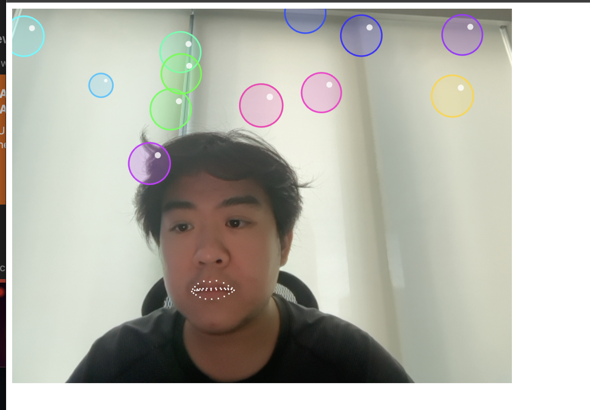
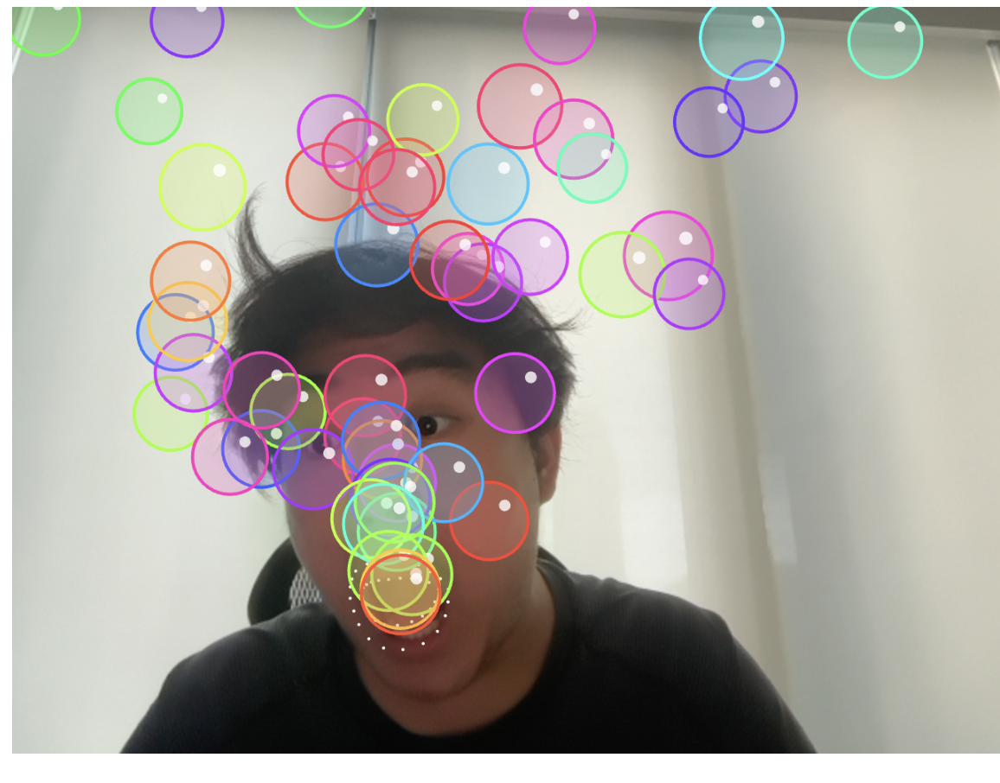
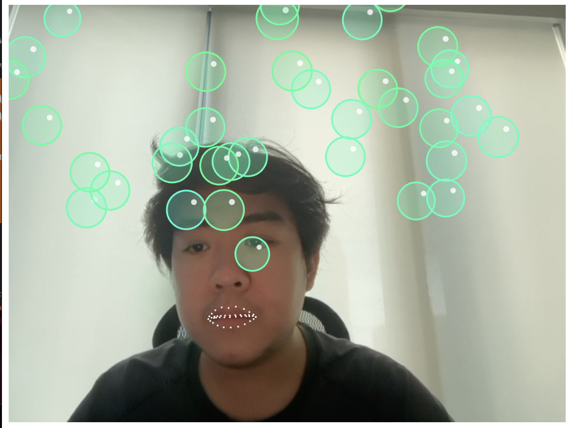

# Research: FaceMesh

<!-- DRAFT: rewrite in your own words, check every claim against the sources -->

## How does the model work?

ml5.faceMesh is built on Google's MediaPipe Face Landmarks model. It works in two steps. First, a face detector finds the face and draws a box around it. Then a second neural network looks only inside that box and predicts 468 points on the face (478 with the iris points turned on). Each point has an x, y, and z, so it is an approximate 3D surface of the face, not just a flat outline ([TensorFlow blog](https://blog.tensorflow.org/2020/03/face-and-hand-tracking-in-browser-with-mediapipe-and-tensorflowjs.html)).

ml5 also groups the points into named parts like `lips`, `leftEye`, and `faceOval`. Each part has its own keypoints and bounding box, so you don't have to memorize the index numbers on the mesh map ([ml5 reference](https://docs.ml5js.org/#/reference/facemesh)).

## What data was it trained on?

According to the [paper](https://arxiv.org/pdf/1907.06724), the training set was about 30,000 "in-the-wild" phone camera photos from around the world. Instead of hand-labeling all 468 points, they rendered a 3D face model over the real photos and only hand-labeled a small set of 2D contour points (eyes, lips, etc.). They kept the real photo backgrounds so the model would not overfit to plain backgrounds.

<!-- TODO: like Assignment 3/4, did you find anything about consent or where the photos came from? The model card (linked on the class page) has fairness numbers by region/skin tone, worth one sentence. -->

## Inspiration

<!-- TODO: pick one project from the class page and say what you took from it -->

I was inspired by Nahuel Gerth's [Bubbles](https://www.instagram.com/p/C6S5BHPCGu3/) and Jack B. Du's [Mouth-Controlled Synthesizer](https://www.instagram.com/p/C41i1VQsfs0/). Both use the mouth as a controller, which feels more playful than using your hands.

# Sketch

You blow bubbles by opening your mouth. The wider you open it, the bigger the bubbles. Raising your eyebrows changes the bubble color, and blinking pops every bubble on screen.

How it works:

- Mouth: I measure the distance between keypoint 13 (inner upper lip) and 14 (inner lower lip). I divide it by the face box width so it still works when you move closer or farther from the camera.
- Eyebrows: I measure how far keypoint 105 (eyebrow) is from keypoint 10 (top of forehead), divided by face height, and `map` it to a hue.
- Blink: for each eye I divide the gap between the eyelids by the width of the eye. When both eyes go from open to closed, all bubbles pop. I only check the moment they close, so keeping your eyes shut doesn't keep popping.
- Color drift: the bubbles don't jump to a new color, they slowly slide toward it, each at its own speed. The colors switch back and forth between two modes. First every bubble drifts to the color your eyebrows pick. Then each bubble drifts to its own random color, and then they all come back together. I adapted this idea from a #Genuary2024 Day 4 "Pixel" sketch, where a grid of squares does the same thing.
- Each bubble is an object that floats up with a little wobble and gets removed once it leaves the screen or finishes popping.
- Mirror: I flip the whole canvas myself with `translate` and `scale(-1, 1)` instead of using the `flipped` option. When I used `flipped`, the lip points moved the opposite way from my face.

## Iterations

<!-- The assignment says: if you use an AI coding agent, do at least 3 iterations of one idea (or 3 different ideas). Fill these in as you go. -->

1. v1: mouth open spawns bubbles.
2. v2: eyebrows control color, blinking pops all bubbles.
3. v3: bubble colors drift between one shared color and random colors (from the Genuary pixel sketch). Fixed the lip points moving opposite to my face by mirroring the canvas myself.

## Sources

- [ml5.faceMesh reference](https://docs.ml5js.org/#/reference/facemesh)
- [Face and hand tracking in the browser with MediaPipe and TensorFlow.js](https://blog.tensorflow.org/2020/03/face-and-hand-tracking-in-browser-with-mediapipe-and-tensorflowjs.html)
- [Real-time Facial Surface Geometry from Monocular Video on Mobile GPUs (paper)](https://arxiv.org/pdf/1907.06724)
- [Genuary 2024 prompts (Day 4: Pixel)](https://genuary.art/prompts#jan4)
- [Class page: 05 Face Models](https://github.com/ml5js/Intro-ML-Arts-IMA-F26/tree/main/05-face-modals)
